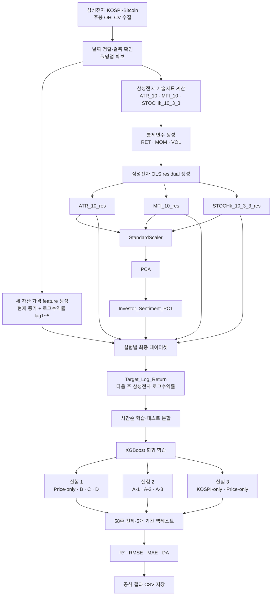
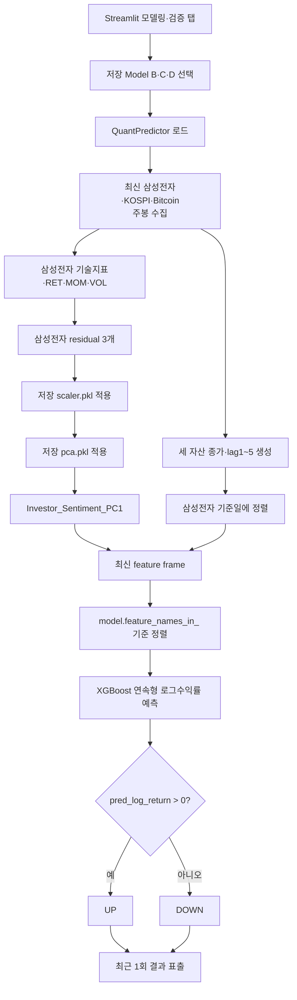

# DataFlow Mermaid 최종본

## 1. 공식 학습·백테스트 흐름

## 2. 최신 데이터 기반 최근 1회 예측 흐름

## 사용 원칙
- 공식 A-1~D 성능은 확정 CSV로 표시합니다.
- 최근 1회 예측은 실제 저장된 B/C/D pkl만 선택합니다.
- residual은 삼성전자에서만 생성합니다.
- 모델은 확률 분류기가 아니라 로그수익률 회귀모델입니다.
